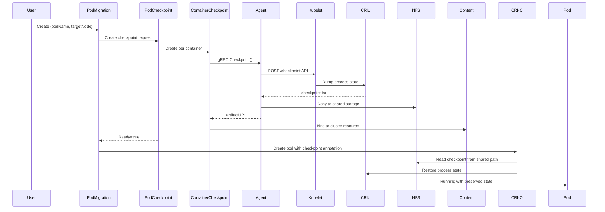

# Live Pod Migration Controller - Technical Overview

## Executive Summary
The Live Pod Migration Controller enables **live migration of running pods between Kubernetes nodes** using CRIU (Checkpoint/Restore In Userspace) technology to preserve process state, memory contents, and file descriptors. This **CRD-driven solution** requires **no kubelet modifications** and orchestrates cross-node pod migration through a distributed control-plane/agent architecture with NFS-based shared storage.

## Architecture & Components

### Core CRDs (Custom Resource Definitions)
1. **PodMigration** (`lpm.my.domain/v1`)
   - Spec: `{podName: string, targetNode: string}`
   - Orchestrates the end-to-end migration workflow
   - Creates PodCheckpoint, monitors completion, triggers restoration

2. **PodCheckpoint** (`lpm.my.domain/v1`)
   - Spec: `{podName: string}`
   - Manages pod-level checkpoint operations
   - Creates ContainerCheckpoints for each container
   - Binds to PodCheckpointContent (cluster-scoped)

3. **ContainerCheckpoint** (`lpm.my.domain/v1`)
   - Spec: `{podName: string, containerName: string}`
   - Represents individual container checkpoint requests
   - Binds to ContainerCheckpointContent with artifact location

4. **PodCheckpointContent/ContainerCheckpointContent**
   - Cluster-scoped resources containing actual checkpoint artifacts
   - Stores `artifactURI` with format: `shared://<podUID>/<checkpointID>/<container>/dump.tar.zst`

### Checkpoint Agent (DaemonSet)
- **Deployment**: Privileged DaemonSet on all nodes (`checkpoint-agent:50051`)
- **gRPC Interface**: `CheckpointService` with methods:
  ```proto
  rpc Checkpoint(CheckpointRequest) returns (CheckpointResponse)
  rpc ConvertCheckpointToImage(ConvertRequest) returns (ConvertResponse)
  ```
- **Kubelet Integration**: Uses kubelet checkpoint API (`https://<node>:10250/checkpoint/<ns>/<pod>/<container>`)
- **TLS Authentication**: Mounts kubelet client certificates from `/etc/kubernetes/pki/`
- **Checkpoint Process**:
  1. Calls kubelet API with backoff retry (5 steps, 2s initial, 2x factor)
  2. Receives checkpoint tar file at `/var/lib/kubelet/checkpoints/`
  3. Copies to shared storage at `/mnt/checkpoints/<podUID>/<checkpointID>/`
  4. Returns artifact URI for controller consumption

### Shared Storage Design (NFS)
```
/mnt/checkpoints/               # NFS mount (ReadWriteMany PVC)
├── <podUID>/                   # Pod-specific directory
│   └── <checkpointID>/         # Timestamp-based checkpoint
│       ├── <containerName>/    
│       │   ├── dump.tar.zst    # CRIU checkpoint (zstd compressed)
│       │   └── manifest.json   # Metadata
│       └── .checkpoint-complete # Completion marker
```

**Implementation**:
- **StorageClass**: `nfs-rwx` with `nfs-subdir-external-provisioner`
- **PVC**: `checkpoint-repo` (20Gi, RWX) in controller namespace
- **Mount Path**: `/mnt/checkpoints` in all agent pods
- **Atomic Operations**: Write to temp file, then rename for consistency

### Controllers (Reconciliation Logic)

**PodMigrationController**:
1. Creates PodCheckpoint for source pod
2. Waits for checkpoint completion (`Ready=true`)
3. Creates restored pod with annotation: `io.kubernetes.cri-o.checkpoint-restore: <artifactURI>`
4. Updates migration status to `Completed`

**PodCheckpointController**:
1. Lists containers in target pod
2. Creates ContainerCheckpoint for each container
3. Monitors all checkpoints for completion
4. Creates PodCheckpointContent when all containers are checkpointed

**ContainerCheckpointController**:
1. Calls agent gRPC service on pod's node
2. Receives artifact URI from agent
3. Creates ContainerCheckpointContent with artifact location
4. Updates checkpoint status to `Ready`

## Migration Workflow



## Vagrant Development Environment

**Cluster Setup**:
- **Master Node**: 192.168.56.10 (4GB RAM, 2 CPUs)
- **Worker Node**: 192.168.56.11 (2GB RAM, 2 CPUs)
- **Base OS**: Ubuntu 22.04 (bento/ubuntu-22.04)
- **Container Runtime**: CRI-O 1.26+ with CRIU 4.1.1
- **Kubernetes**: 1.26+ with checkpoint API enabled

**Key Configuration**:
```bash
# CRI-O checkpoint support
enable_criu_support = true
drop_infra_ctr = false

# Kubelet feature gates
--feature-gates=ContainerCheckpoint=true
```

## Demo & Results

### Analytics Counter Demo
Demonstrates **stateful process preservation** during migration:
- **Application**: Python analytics processor with accumulating state
- **State Preserved**: Event counter, revenue totals, processing position
- **Migration Time**: ~30 seconds for checkpoint, transfer, and restore
- **Success Metrics**: Counter continues from checkpoint (not reset), revenue accumulation maintained

### Flink Streaming Demo (Limited)
**Current Limitation**: CRIU cannot checkpoint active TCP connections
- **Error**: `Connected TCP socket, consider using --tcp-established option`
- **Root Cause**: Flink JobManager/TaskManager TCP connections
- **Solution Path**: Configure CRI-O with `--tcp-established` flag or use Flink savepoints

## Technical Achievements

### ✅ Accomplished
1. **Zero Kubelet Modification**: Entirely CRD-driven using existing checkpoint API
2. **Cross-Node Migration**: NFS shared storage enables node-to-node transfers
3. **Process State Preservation**: Memory, file descriptors, counters maintained
4. **Atomic Operations**: Checkpoint completion markers prevent partial reads
5. **Automatic Restoration**: CRI-O annotation-based checkpoint restore
6. **Production Architecture**: Scalable control-plane/agent separation

### 🔄 Limitations & Future Work
1. **TCP Connections**: Requires `--tcp-established` CRIU flag for network-heavy apps
2. **Storage Performance**: NFS bottleneck for large checkpoints (consider object storage)
3. **Security**: No encryption for checkpoint data in transit/rest
4. **Incremental Checkpoints**: Full dumps only (no delta compression)
5. **Network State**: Limited TCP restoration capabilities

## Key Technical Specifications

**CRIU Integration**:
```bash
criu dump --tree $PID --images-dir /checkpoint \
  --leave-running --file-locks --tcp-established
```

**CRI-O Restore Annotation**:
```yaml
io.kubernetes.cri-o.checkpoint-restore: "shared://<podUID>/<checkpointID>/<container>/dump.tar.zst"
```

**Agent gRPC Message**:
```protobuf
message CheckpointRequest {
  string pod_namespace = 1;
  string pod_name = 2;
  string container_name = 3;
  string pod_uid = 4;
}
```

## Conclusion
The Live Pod Migration Controller demonstrates a **production-viable approach** to stateful pod migration in Kubernetes, leveraging standard APIs and container runtime features without invasive modifications. The architecture successfully preserves application state across nodes, though complex networking scenarios (like Flink) require additional CRIU configuration. This foundation enables advanced use cases like node maintenance, resource optimization, and disaster recovery while maintaining application continuity.